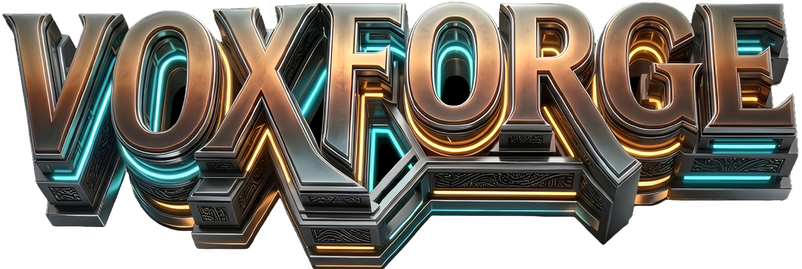

<!-- ╔══════════════════════════════════════════════════════════════════╗ -->
<!-- ║           V O X F O R G E  ·  2 . 0  README                     ║ -->
<!-- ╚══════════════════════════════════════════════════════════════════╝ -->

<div align="center">



### ⬡ &nbsp; A Browser-Based 3D Voxel World Engine &nbsp; ⬡

<br>


<br>

> **"Built different fr fr"** — *VoxForge Splash Screen*

<br>

---

</div>

## 🌐 What is VoxForge?

**VoxForge 2.0** is a fully browser-native, zero-dependency voxel sandbox game — built from scratch using **Three.js** and pure **ES Modules**. No Unity. No game engine. No build tools. Just raw JavaScript, procedural terrain, physics, and real-time 3D rendering, all running at full speed inside your browser tab.

Inspired by the voxel genre, VoxForge features a **neon-noir UI**, **4 biome types**, **progressive block breaking**, **day/night cycles**, **RTX-style post-processing**, and a fully modular codebase designed for extension.

<br>

---

## ✨ Feature Showcase

<div align="center">

| 🌍 World | 🎮 Gameplay | 🖥️ Rendering | 🧠 Engine |
|:-:|:-:|:-:|:-:|
| Procedural terrain (fBm noise) | WASD + Mouse-look | Three.js InstancedMesh | ES6 Module architecture |
| 4 Biomes (Plains, Desert, Snowy, Forest) | Progressive block breaking | Per-block procedural textures | AABB physics collision |
| Tree & cactus generation | Block placement + hotbar | Dynamic day/night sky | DDA voxel raycasting |
| Sea level water | Fly mode | RTX bloom filter | Chunk dirty-flag meshing |
| Snowy peaks & ice | Health + food bars | Minimap (real-time) | Auto-save (60s interval) |
| World seed support | Sprint + swim | Compass + biome tag | LocalStorage persistence |

</div>

<br>

---

## 🗂️ Project Architecture

```
VoxForge-2.0/
│
├── 📄 index.html              ── Entry point · All CSS · Full UI system
│                                 (Main menu, modals, HUD, death screen)
│
├── ⚙️  vercel.json            ── Deployment config (Vercel)
│
└── 📁 src/
    │
    ├── 🚀 main.js             ── Boot sequence · Game loop · Menu orbit camera
    │                             Minimap · Compass · Biome tag · Auto-save
    │
    ├── 📁 world/
    │   ├── 🧱 blocks.js       ── Block registry (18 block types, full properties)
    │   ├── 🌐 world.js        ── World data array · Chunk tracking · Save/Load
    │   └── 🏔️  worldgen.js    ── fBm terrain noise · Biome system · Tree/cactus gen
    │
    ├── 📁 render/
    │   ├── 💡 renderer.js     ── Three.js setup · Lighting · Day/Night · Block highlight
    │   ├── 🔲 mesher.js       ── Chunk mesh builder · InstancedMesh per block type
    │   └── 🎨 textures.js     ── Procedural pixel textures · Material cache
    │
    ├── 📁 player/
    │   ├── 🧍 physics.js      ── Player state · AABB collision · Walk/Swim/Fly
    │   ├── 🎯 raycast.js      ── DDA raycasting · Block targeting
    │   ├── ⌨️  input.js        ── Keyboard · Mouse · Scroll wheel handlers
    │   └── ⛏️  breaking.js    ── Progressive block break with hardness timer
    │
    └── 📁 ui/
        └── 🖥️  hud.js         ── Hotbar · Health/Food bars · Toasts · Death screen
```

<br>

---

## 🧱 Block Registry

VoxForge ships with **18 unique block types**, each with full physical and visual properties:

| ID | Block | Hardness | Special |
|:--:|:-----:|:--------:|:-------:|
| 1  | 🌿 Grass     | 0.9s | — |
| 2  | 🟫 Dirt      | 0.8s | — |
| 3  | 🪨 Stone     | 2.5s | — |
| 4  | 🪵 Wood      | 1.5s | — |
| 5  | 🍃 Leaves    | 0.4s | Semi-transparent |
| 6  | 🏖️ Sand      | 0.8s | — |
| 7  | 💧 Water     | ∞    | Non-solid · Alpha 0.70 |
| 8  | 🪨 Gravel    | 0.8s | — |
| 9  | 🧱 Cobble    | 2.0s | — |
| 10 | 🔦 Torch     | 0.1s | Light source |
| 11 | ❄️ Snow      | 0.3s | — |
| 12 | 🧊 Ice       | 0.5s | Transparent · Alpha 0.75 |
| 13 | 🌵 Cactus    | 0.4s | — |
| 14 | ✨ Glowstone | 0.3s | Light source |
| 15 | 🪟 Glass     | 0.3s | Alpha 0.45 |
| 16 | 🖤 Obsidian  | 8.0s | Hardest block |
| 17 | 🧱 Brick     | 2.0s | — |
| 18 | 🏜️ Sandstone | 1.2s | — |

<br>

---

## 🎮 Controls

```
┌─────────────────────────────────────────────────────────────────┐
│                    K E Y B I N D S                              │
├────────────────┬────────────────────────────────────────────────┤
│  WASD          │  Move                                          │
│  SPACE         │  Jump                                          │
│  SHIFT         │  Sprint                                        │
│  F             │  Toggle fly mode                              │
│  LMB (hold)    │  Break block (progressive)                    │
│  RMB           │  Place block                                  │
│  Scroll / 1–8  │  Select hotbar slot                           │
│  Q             │  Eat (restore food)                           │
│  R             │  Respawn (when dead)                          │
│  Tab           │  Toggle debug info                            │
│  Ctrl + S      │  Manual save                                  │
│  Esc           │  Pause                                        │
└────────────────┴────────────────────────────────────────────────┘
```

<br>

---

## 🚀 Getting Started

> ⚠️ VoxForge uses **ES Modules** — `index.html` **cannot** be opened directly as a file. You must serve it over HTTP.

### Option 1 — Python (built into most systems)
```bash
# Clone the repo
git clone https://github.com/your-username/VoxForge-2.0.git
cd VoxForge-2.0

# Serve locally
python3 -m http.server 8080

# Open in browser
# → http://localhost:8080
```

### Option 2 — Node.js
```bash
cd VoxForge-2.0
npx serve .
```

### Option 3 — VS Code Live Server
```
1. Install the "Live Server" extension
2. Right-click index.html → "Open with Live Server"
```

### Option 4 — Deploy to Vercel (Zero Config)
```bash
npm i -g vercel
vercel
# ✓ VoxForge is now live at https://voxforge.vercel.app
```

<br>

---

## 🔧 Extending VoxForge

### ➕ Add a New Block Type
Edit `src/world/blocks.js` — add an entry to the `BD` object:
```javascript
19: {
  name: 'Ruby Ore',
  top: [200, 50, 80], side: [180, 40, 60], bot: [200, 50, 80],
  solid: true, opaque: true, hardness: 3.5
}
```
Then add the ID to `PLACE_IDS` to make it placeable.

---

### 🌍 Make a Bigger World
In `src/world/world.js`, increase `WSIZ` (keep it a multiple of 16):
```javascript
export const WSIZ  = 256;  // was 128 — doubles the world
export const WMAXH = 80;   // increase max height
```

---

### 🏔️ Customize Terrain Shape
Edit the `fbm()` function in `src/world/worldgen.js`:
```javascript
export function fbm(x, z) {
  return vnoise(x*.030, z*.030)*.60   // flatter plains
       + vnoise(x*.080, z*.080)*.25
       + vnoise(x*.180, z*.180)*.10
       + vnoise(x*.400, z*.400)*.05;
}
```

---

### 🌿 Add a New Biome
In `worldgen.js`, extend the `getBiome()` thresholds:
```javascript
function getBiome(x, z) {
  const n = biomeNoise(x, z);
  if (n < 0.20) return 4;  // New biome: Swamp
  if (n < 0.35) return 1;  // Desert
  // ...
}
```

---

### 🖼️ Use Real PNG Textures
Replace `mkTex()` in `src/render/textures.js`:
```javascript
import * as THREE from 'three';
const loader = new THREE.TextureLoader();
const grassTop = loader.load('./assets/textures/grass_top.png');
grassTop.magFilter = THREE.NearestFilter; // pixelated style
```

---

### 💾 Infinite World (Advanced)
Refactor `src/world/world.js` to use a `Map` keyed by `"cx,cz"` and stream chunks in/out as the player moves — enabling true infinite terrain.

<br>

---

## 🧩 Tech Stack

<div align="center">

| Layer | Technology |
|:-----:|:----------:|
| 3D Renderer | [Three.js r128](https://threejs.org/) |
| Language | JavaScript ES2020+ (Modules) |
| Physics | Custom AABB (hand-coded) |
| Terrain | Fractional Brownian Motion (fBm) |
| Persistence | Browser LocalStorage |
| Deployment | Vercel |
| Fonts | Orbitron · Rajdhani · Share Tech Mono |

</div>

<br>

---

## 📁 Roadmap

- [ ] 🌐 Multiplayer (WebSocket / WebRTC)
- [ ] 🌍 VoxForge Realms (cloud worlds)
- [ ] 🧥 Full skin system (PNG upload + 3D preview)
- [ ] 🌐 50+ language localisation
- [ ] ⬆️ DLSS 4.0 / FSR 4.0 / XeSS upscaling
- [ ] 🎵 Ambient audio + music
- [ ] 🌋 More biomes (Swamp, Mesa, Jungle)
- [ ] 🤖 Mobs & entities
- [ ] 🧪 Crafting system
- [ ] 📱 Mobile touch controls

<br>

---

## 📜 License & Copyright

```
Copyright © SeWalk Ltd. 2026. All Rights Reserved.
Do not distribute without permission.
```

VoxForge is a proprietary project developed under **SeWalk Ltd.**
Unauthorized copying, redistribution, or commercial use is strictly prohibited.

<br>

---

<div align="center">

## 👨‍💻 About the Developer

```
╔═══════════════════════════════════════════════════════╗
║                                                       ║
║   ██████╗  ██████╗ ██╗   ██╗███╗   ███╗              ║
║   ██╔══██╗██╔═══██╗██║   ██║████╗ ████║              ║
║   ██████╔╝██║   ██║██║   ██║██╔████╔██║              ║
║   ██╔══██╗██║   ██║██║   ██║██║╚██╔╝██║              ║
║   ██║  ██║╚██████╔╝╚██████╔╝██║ ╚═╝ ██║              ║
║   ╚═╝  ╚═╝ ╚═════╝  ╚═════╝ ╚═╝     ╚═╝              ║
║                                                       ║
║      S O U M Y A D I P                               ║
║      Early Developer in Learning — 🇮🇳 India         ║
║                                                       ║
╚═══════════════════════════════════════════════════════╝
```

**Soumyadip** is a self-taught developer from India who builds things that shouldn't be possible for someone "just learning."

At a stage where most developers are still reading tutorials, Soumyadip shipped **SeWalk AI** — a full multimodal SaaS application — in just **2 days**, AI-assisted. Now, VoxForge 2.0 proves that wasn't a fluke.

> *"The best way to learn is to build things too big for your skill level — and then figure it out anyway."*

<br>


<br>

---

*VoxForge 2.0 — Built different. Forged in code. ⬡*

</div>

# 𝐕𝐨𝐱𝐅𝐨𝐫𝐠𝐞

A browser-based Minecraft-inspired voxel game built with Three.js.

## Running the Game

Because the game uses ES Modules (`import`/`export`), you **must** serve it via a local HTTP server — you can't just open `index.html` directly in a browser.

```bash
# Option 1 – Python (built into most computers)
cd mineclone
python3 -m http.server 8080
# Then open: http://localhost:8080

# Option 2 – Node.js
npx serve .

# Option 3 – VS Code
# Install the "Live Server" extension and click "Go Live"
```

---

## Project Structure

```
mineclone/
├── index.html              ← Entry point + all CSS + UI HTML
├── src/
│   ├── main.js             ← Game loop, boot sequence, wires everything together
│   │
│   ├── world/
│   │   ├── blocks.js       ← Block registry (add new block types here)
│   │   ├── world.js        ← World data array, chunk dirty tracking
│   │   └── worldgen.js     ← Procedural terrain generation (noise, trees)
│   │
│   ├── render/
│   │   ├── renderer.js     ← Three.js setup, lighting, day/night, highlight
│   │   ├── mesher.js       ← Chunk mesh building (InstancedMesh per block type)
│   │   └── textures.js     ← Procedural pixel textures + material cache
│   │
│   ├── player/
│   │   ├── physics.js      ← Player state, AABB collision, walk/swim/fly
│   │   ├── raycast.js      ← DDA raycast for block targeting
│   │   ├── input.js        ← Keyboard, mouse, scroll wheel handlers
│   │   └── breaking.js     ← Progressive block breaking with hardness
│   │
│   └── ui/
│       └── hud.js          ← Hotbar, health/food bars, toasts, death screen
│
└── assets/
    └── textures/           ← Put PNG textures here when you add them
```

---

## How to Add Things

### New block type
Edit `src/world/blocks.js` — add an entry to `BD` and optionally add the ID to `PLACE_IDS`.

### Bigger world
In `src/world/world.js`, increase `WSIZ` (keep it a multiple of 16) and/or `WMAXH`.

### Different terrain shape
Edit the `fbm()` function in `src/world/worldgen.js` — change octave weights or frequencies.

### New biome
In `worldgen.js`, check the `fbm` value range per column and switch block types accordingly.

### Real PNG textures
Replace `mkTex()` in `src/render/textures.js` with a `THREE.TextureLoader` call per block.

### Save / Load
Add `localStorage` read/write to `src/world/world.js` — serialize `wdata` as a base64 string.

### Infinite world
Refactor `src/world/world.js` to use a `Map` keyed by `"cx,cz"` instead of a fixed array, and stream chunks in/out as the player moves.

---

## Controls

| Key | Action |
|-----|--------|
| WASD | Move |
| Space | Jump |
| Shift | Sprint |
| LMB (hold) | Break block |
| RMB | Place block |
| Scroll / 1–8 | Select hotbar slot |
| F | Toggle fly mode |
| Q | Eat (restore food) |
| R | Respawn (when dead) |
| Tab | Toggle debug info |
| Esc | Pause |
